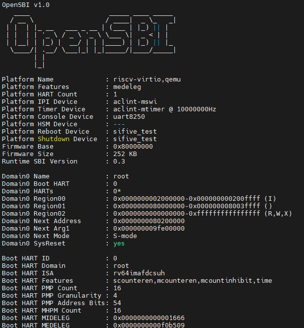
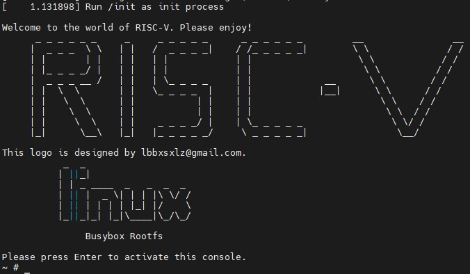
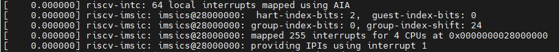
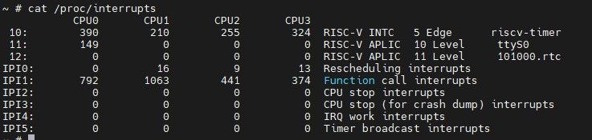
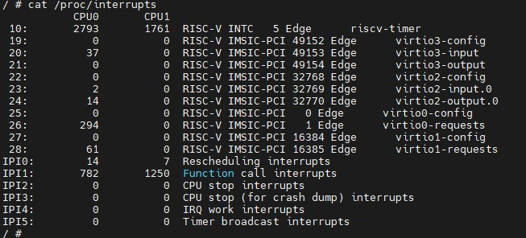
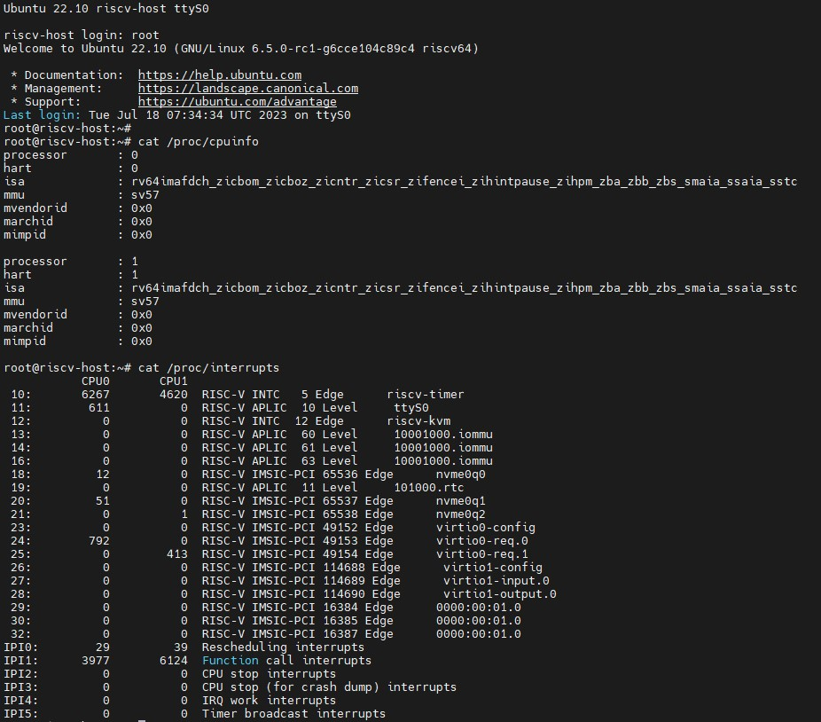

# riscv-practice
Technology Readiness for RISC-V

## RISC-V GNU Compiler Toolchain
Download and compile the RISC-V Toolchain, more detail in [riscv-toolchain](https://github.com/riscv-collab/riscv-gnu-toolchain)
qemu is not necessary for toolchain, can remove it
```bash
git clone https://github.com/riscv/riscv-gnu-toolchain
sudo apt-get install autoconf automake autotools-dev curl python3 python3-pip libmpc-dev libmpfr-dev libgmp-dev gawk build-essential bison flex texinfo gperf libtool patchutils bc zlib1g-dev libexpat-dev ninja-build git cmake libglib2.0-dev
git rm qemu
git submodule update --init --recursive
./configure --prefix=/opt/riscv --with-arch=rv64gc --with-abi=lp64d
sudo make linux -j $(nproc)

#./configure --prefix=/opt/riscv --with-arch=rv64imafdc_zicsr_zifencei --with-abi=lp64d
make -j $(nproc)
```
Add the path of compiler to your `PATH`
```bash
  export PATH=/opt/riscv/bin/:$PATH
```
Validate the compiler
```bash
  riscv64-unknown-linux-gnu-gcc -v
```

## KVM RISCV64 on QEMU




more detail in [test steps](riscv_kvm/README.md)

## KVM RISCV AIA on qemu






The test steps are described in [document](riscv_aia/README.md)

## IOMMU on qemu


More details in [README](riscv_iommu/README.md)
